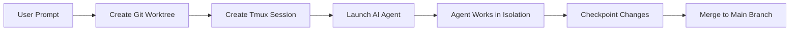

Uzi combines three core technologies to enable parallel AI development workflows: **Git worktrees** for isolated code environments, **Tmux** for session management, and **AI agents** for autonomous development.

## High-Level Overview

When you run a prompt with Uzi, the following happens:



## Core Components

### 1. Git Worktrees

Each agent operates in its own **Git worktree** - a separate working directory linked to your repository. This enables:

- **Isolation**: Multiple agents work on different branches simultaneously without conflicts
- **Branch management**: Each worktree has its own branch derived from your main branch
- **Storage**: Worktrees are stored in `~/.local/share/uzi/worktrees/`

Learn more in [Worktrees](/concepts/worktrees).

### 2. Tmux Sessions

Each agent runs in a dedicated **Tmux session** that provides:

- **Persistence**: Sessions continue running even if you disconnect
- **Multi-window support**: Separate windows for the agent and development server
- **Session naming**: Format `agent-{projectDir}-{gitHash}-{agentName}`

Learn more in [Sessions](/concepts/sessions).

### 3. AI Agents

Agents are AI-powered development assistants that:

- **Execute autonomously**: Run commands and make code changes in their worktree
- **Have unique identities**: Each agent gets a random name (john, sarah, etc.)
- **Support multiple models**: Claude, Codex, or custom agent commands

Learn more in [Agents](/concepts/agents).

### 4. State Management

Uzi tracks all active agents in a central state file located at `~/.local/share/uzi/state.json`. This state includes:

```go
type AgentState struct {
    GitRepo      string    // Origin repository URL
    BranchFrom   string    // Base branch (main/master)
    BranchName   string    // Agent's unique branch
    Prompt       string    // Original prompt text
    WorktreePath string    // Path to worktree
    Port         int       // Development server port
    Model        string    // Agent model/command
    CreatedAt    time.Time // Session creation time
    UpdatedAt    time.Time // Last activity time
}
```

<Info>
The state manager automatically cleans up entries when sessions are killed, ensuring your state file stays synchronized with active agents.
</Info>

## Data Flow

Here's how data flows through Uzi when you create an agent:

### Step 1: Prompt Submission

You run `uzi prompt "implement feature X"` with an agent specification:

```bash
uzi prompt --agents=claude:1 "Add authentication to the API"
```

### Step 2: Worktree Creation

Uzi creates a new worktree in `~/.local/share/uzi/worktrees/`:

- **Branch name**: `{agentName}-{projectDir}-{gitHash}-{timestamp}`
- **Worktree path**: `~/.local/share/uzi/worktrees/{worktreeName}`
- **Base branch**: Automatically detected (main/master)

<Note>
Worktrees are created with `git worktree add -b {branchName} {worktreePath}`, ensuring they're properly linked to your repository.
</Note>

### Step 3: Tmux Session Setup

Uzi creates a Tmux session with the following structure:

```
Session: agent-myproject-a1b2c3d-sarah
├── Window 0: agent (AI agent runs here)
└── Window 1: uzi-dev (development server)
```

### Step 4: Agent Execution

The AI agent receives the prompt and begins working:

- Commands run in the agent's isolated worktree
- All changes are tracked on the agent's unique branch
- Development server (if configured) runs on a dedicated port

### Step 5: Checkpoint and Merge

When you're ready to integrate changes:

```bash
uzi checkpoint sarah "Implemented authentication"
```

This rebases the agent's commits onto your current branch:

```go
// From checkpoint.go:146
rebaseCmd := exec.CommandContext(ctx, "git", "rebase", agentBranchName)
```

## Storage Locations

Uzi uses the following directories (all under `~/.local/share/uzi/`):

| Directory | Purpose | Example |
|-----------|---------|----------|
| `worktrees/` | Git worktree storage | `worktrees/sarah-myapp-a1b2c3d-1234/` |
| `worktree/{sessionName}/` | Per-session metadata | `worktree/agent-myapp-a1b2c3d-sarah/tree` |
| `state.json` | Active agent state | Single JSON file with all sessions |

<Tip>
You can inspect active agents at any time with `uzi ls` or watch them in real-time with `uzi ls -w`.
</Tip>

## Port Allocation

When a development server is configured, Uzi automatically allocates ports:

```go
// From prompt.go:271
selectedPort, err = findAvailablePort(startPort, endPort, assignedPorts)
```

- Ports are allocated from the configured range (e.g., `3000-4000`)
- Each agent gets a unique port to prevent collisions
- Port assignments are tracked in state and displayed by `uzi ls`

## Isolation Benefits

The Git worktree + Tmux architecture provides:

1. **No context switching**: Each agent has its own complete environment
2. **Parallel development**: Multiple agents work on different features simultaneously
3. **Clean separation**: Changes in one agent don't affect others
4. **Easy cleanup**: `uzi kill {agent}` removes all associated resources

## Next Steps

<CardGroup cols={2}>
  <Card title="Worktrees" icon="code-branch" href="/concepts/worktrees">
    Deep dive into Git worktrees and isolation
  </Card>
  <Card title="Sessions" icon="window" href="/concepts/sessions">
    Learn about Tmux session management
  </Card>
  <Card title="Agents" icon="robot" href="/concepts/agents">
    Understand agent naming and commands
  </Card>
  <Card title="State Management" icon="database" href="/concepts/state">
    Explore how Uzi tracks agent state
  </Card>
</CardGroup>